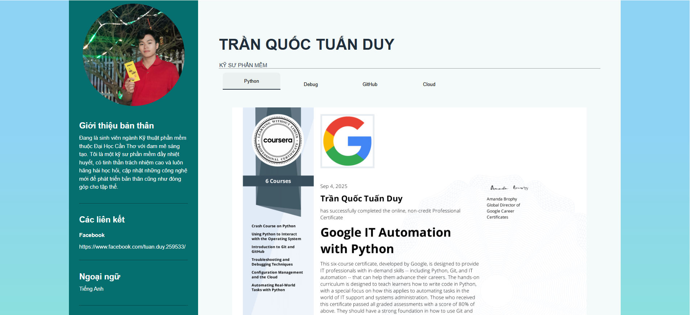

# 💼 Personal Portfolio (ReactJS)

Xin chào 👋 Đây là website **CV/Portfolio cá nhân** của mình, được xây dựng bằng **ReactJS**.  
Website này giúp mình giới thiệu bản thân, kỹ năng, kinh nghiệm làm việc, các chứng chỉ và dự án nổi bật.  

---

## 🚀 Tính năng

- 🧑‍💻 **Giới thiệu bản thân** (About Me)
- 🛠 **Kỹ năng** (Skills & Technologies)
- 📂 **Dự án cá nhân** (Projects Showcase)
- 📞 **Thông tin liên hệ** (Contact Form / Social Links)
- 📱 **Responsive Design** (hiển thị tốt trên cả desktop và mobile)
- 🎨 **UI hiện đại** với hiệu ứng hover, animation mượt mà

---

## 🖼️ Demo giao diện



---

## 🛠️ Công nghệ sử dụng

- ⚛️ [ReactJS](https://react.dev/) – Framework chính
- 🎨 HTML/CSS
- 📧 EmailJS gochoctapcuatuanduy@gmail.com

---

## 📦 Cài đặt & Chạy dự án

### Clone project về máy:

```bash
git clone https://github.com/tuanduy35399/My-CV-Web-React.git
**

### Truy cập vào thư mục chứa dự án
```bash
cd My-CV-Web-React
**

### Tải các module cần thiết
```bash
npm i
**

### Khởi chạy dự án
```bash
npm run dev
**
